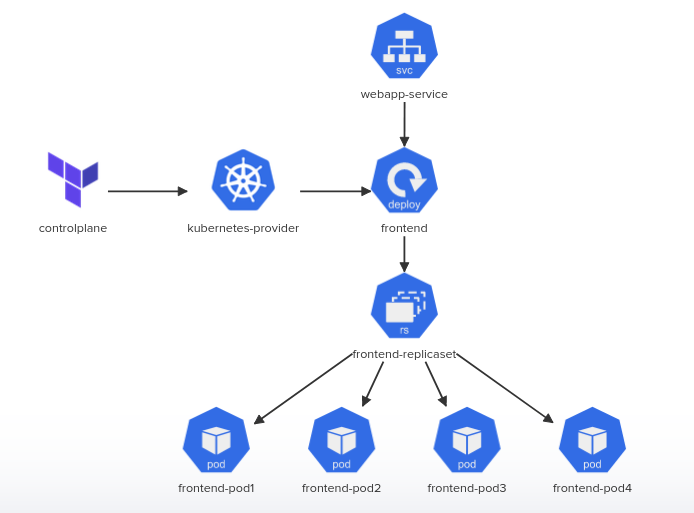

    

# Kodekloud Terraform Challenges

This repository contains my solutions for the [Kodekloud Terraform challenges](https://kodekloud.com/courses/terraform-challenges/). Each challenge requires you to apply your knowledge of Terraform to solve a problem or implement a specific architecture.

## Challenges

The repository contains the following challenges:

### Challenge 1

The objective of this challenge is to utilize `Terraform` for setting up a `Kubernetes` deployment, which includes 4 replica sets, to host a web application image. Additionally, a node port service will be established to enable access to the web application.

solution: [/challenge-1](/challenge-1/)

 

### Challenge 2

This challenge aims to create a simple `LAMP stack` with the help of `Terraform` and `Docker`. It involves building two Docker images, one for an Apache server and the other for a custom MariaDB, using two separate Dockerfiles. The next step is to deploy three containers on a private network, one for each of the previously created Docker images, and another one to host `phpMyAdmin`, a web interface that facilitates managing MySQL and MariaDB databases. Finally, a volume will be attached to the MariaDB container to store data.

solution: [/challenge-2](/challenge-2/)

 

### Challenge 3

The goal of this challenge is to utilize `Terraform` to generate a `key_pair`. This will be followed by the creation of a basic `EC2 instance`, which will have `nginx` installed on it. Additionally, an `Elastic IP` will be attached to the instance to enable static public IP address.

## Conclusion

In conclusion, these Terraform challenges from KodeKloud provided a great opportunity to learn and practice various Terraform configurations. By completing these challenges, I was able to improve my Terraform skills and gain more experience with infrastructure as code.